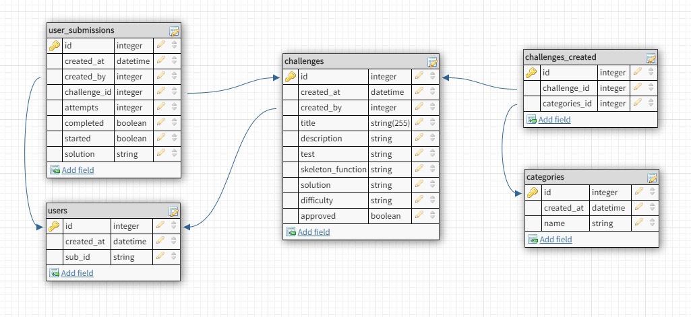

# API Documentation

## Backend Deployed On Heroku [https://clone-coding-server.herokuapp.com/](https://clone-coding-server.herokuapp.com/) <br>

##  Getting Started

### Scripts

- **yarn install** to install all required dependencies
- **yarn dev** to start the local server
- **yarn test** to start server using testing environment  
- **yarn db_start_dev** to start docker development Postgres database
- **yarn db_start_test** to start docker testing database
- **yarn db_reset_dev** to migrate and rollback seeds in developer database
- **yarn db_reset_test** to migrate and rollback seeds in developer tests
- **yarn db_stop_dev** burns down development database
- **yarn db_stop_test** burn down testing database
  
## Using Express Backend Framework

### We used this framework for these reasons

- Minimal and flexible
- Highly customizable
- Written in Javascript, allowing us to write in same language for frontend and backend
- Compatible with AuthO libraries

# Route List
## Get user ID out of the req.headers.users which is populated in the auth middleware
- **GET /api/users**
  - Get logged in user profile information
    - Can be used to see if the user is logged in
    - Can be used to get the role of the user
- **GET /api/categories**
  - Get an array of categories for:
    - Create Challenge Form
    - Search Challenges Category Filter
- **POST /api/challenges**
  - Create a new code challenge
- **PUT /api/challenges**
  - Edit a code challenge
    - Users can edit unapproved challenges they created
    - Admins can edit any unapproved challenges
    - Admins can approve a challenge
- **GET /api/challenges**
  - Get code challenge(s)
    - Users can get unapproved challenges they created
    - Admins can get any unapproved challenges
    - Users and Admins can get any approved challenges
    - Users and Admins can filter challenges by difficulty
- **POST /api/submissions**
  - Create a new submission
    - User is starting a code challenge
- **PUT /api/submissions**
  - Edit a submission
    - Users can only edit submissions they created
    - Users can update their answer
    - Users can retake a challenge they already completed
- **GET /api/submissions**
  - Get submission(s)
    - Users can get submissions they created
    - Users can get all submissions they have completed
    - Users can get all submissions they started on
    - Users can get a submission for a specific challenge
- **PUT /api/validation**
  - Validate a submission's answer
    - Users can optionally update their answer when validating

# Getting user profile information

## GET /api/users

- Get user profile information
- User ID is acquired using the access token in the Authorization header
- Will return an error if token is invalid
- Can be used to confirm user is logged in

### --- Sent 

#### Request Body:
```
{

}
```

### --- Received 201

#### Returns user information:
```
{
  id: INTEGER
  xp: INTEGER
  role: STRING
}
```

---

# Getting category information

## GET /api/categories

- Get an array of category information 

### --- Sent 

#### Request Body:
```
{

}
```

### --- Received 201

#### Returns an array of category information:
```
[
  {
    id: INTEGER
    name: STRING
    created_at: DATE
  }
]
```

---

# Creating a new code challenge

## POST /api/challenges

- Allow any registered user to create a challenge
- Double check the approved column is false
- Validate format of payload

### --- Sent

#### Request Body:
```
{
  title: STRING - Required - Unique
  description: STRING - Required
  tests: JSON - Required
  skeleton_function: STRING - Required
  solution: STRING - Required
  difficulty: INTEGER - Required
}
```

### --- Received 201

#### Returns the new challenge:
```
{
  id: INTEGER
  title: STRING
  description: STRING
  tests: JSON
  skeleton_function: STRING
  solution: STRING
  difficulty: INTEGER
}
```

# Editing an existing code challenge

## PUT /api/challenges/

- Only owner of challenge can edit
- For users to edit unapproved challenges they created
- For admins to edit any unapproved challenges
- Expects a payload of challenge data
- Validate payload data

### --- Sent

#### Request Body:
```
{
  id: INTEGER - Required
  title: STRING - Required - Unique
  description: STRING - Required
  tests: JSON - Required
  skeleton_function: STRING - Required
  solution: STRING - Required
  difficulty: INTEGER - Required
}
```

### --- Received 201

#### Returns the updated challenge:
```
{
  id: INTEGER
  title: STRING
  description: STRING
  tests: JSON
  skeleton_function: STRING
  solution: STRING
  difficulty: INTEGER
}
```

# Getting Available Challenges

## GET /api/challenges

- Query parameters can be used to filter results
- By default it returns all approved challenges
- Any registered user can access this endpoint
- Regular users should only be able to access approved challenges no matter if they created them or not, and unapproved challenges that they created
- Only admins can access all challenges
- Returns an array of challenges

### --- Sent

#### Optional Query Parameters:
 - difficulty: RANGE - Optional - String like '1-100' (all), '1-33' (easy), '33-66' (medium), or '66-100' (hard)
 - created_by: NUMBER - Optional - ID number of user
 - approved: BOOLEAN - Optional - Whether the challenge should be approved or unapproved
 - id: NUMBER - Optional - ID of challenge
 - category_name: STRING - Optional - Name of challenge
 - category_id: NUMBER - Optional - ID of category

#### Request Body:
```
{

}
```

### --- Received 200

#### Returns an array of challenges:
```
[
  {
    id number
    approved: BOOLEAN
    title: STRING
    description: STRING
    tests: JSON
    skeleton_function: STRING
    solution: STRING
    difficulty: INTEGER
    challenges: [
      {
        id: 1
        name: 'Strings'
      },
      {
        id: 2
        name: 'Numbers'
      },
      ...
    ]
  }
]
```
---

# Updating A Submission

## PUT /api/submissions
* Save a user's submission answer and completed state from true to false
* Takes the ID of the submission
* Solution should be the only column users are allowed to updated
* Users should only be able to update their own submissions
* Check to make sure the submission exists- If not throw an error

### --- Sent

#### Request Body:
```
{
  id: NUMBER - Required
  completed: BOOLEAN - Optional
  solution: STRING - Optional
}
```

### --- Received 200

#### Returns the updated submission:
```
{
  id
  challenge_id
  attempts
  completed
  solution
}
```

# Creating A Submission

## POST /api/submissions
- Populate skeleton function 
- Takes the ID of the challenge
- Check to make sure the challenge exists- If not throw an error
- Check to make sure submission does not exist for user- if one exists throw error

### --- Sent

#### Request Body:
```
{
  challenge_id - INTEGER - Required
}
```

### --- Received, 201

#### Returns the new challenge submission:
```
{
  id
  challenge_id
  attempts
  completed
  solution
}
```

# Getting Challenge Submissions

## GET /api/submissions

- Object-literal query parameters located in req.query can be used to filter query results
- Users should only be able to access their own submissions
- Any registered user can access this endpoint
- Returns an array of submissions

### --- Sent

#### Optional Query Parameters:
 - challenge_id
 - completed

#### Request Body:
```
{
 
}
```

### --- Received

#### Array of challenge submissions:
```
[
  {
   id
   challenge_id
   attempts
   completed
   solution
  }
]
```

# Validating a Challenge Submission Has A Correct Answer

## PUT /api/validation
* Validate a user has the correct answer and update the database entry accordingly
* Similar to /api/submissions PUT tests code
* Uses the ID of the applicable user_submission entry 
* Users should only be able to request validation on submissions they created
* Users should only be able to request validation of solutions which have not already been verified as correct

### --- Sent

#### Request Body:
```
{
  id: STRING - Required - ID of the applicable user_submission
  solution: STRING - Required
}
```

### --- Received, 201

#### Returns an updated submission:
```
{
  id
  challenge_id
  attempts
  completed
  solution
}
```

# Data Model

## The following represents each table in the database:



##  users

---

```
{
  id: UUID
  created_at: DATETIME - Optional - Defaults to current time
  sub_id: STRING - Required - Unique - Auth0 sub id
}
```

## categories

---

```
{
  id: UUID
  created_at: DATETIME - Optional - Defaults to current time
  name: STRING - Required - Unique
}
```

## challenges
---
```
{
  id: UUID
  created_at: DATETIME - Optional - Defaults to current time
  created_by: UUID - Required - Foreign key in USERS table
  title: STRING - Required - Unique
  description: STRING - Required
  tests: JSON - Required
  skeleton_function: STRING - Required
  solution: STRING - Required
  difficulty: STRING - Required
  approved: BOOLEAN - Optional - Defaults to false
}
```

## challenges_categories

---

```
{
  id: UUID
  challenges_id: UUID - Required - Foreign key in CHALLENGES table
  categories_id: UUID - Required - Foreign key in CATEGORIES table
}
```

## user_submissions

---

```
{
  id: UUID
  created_at: DATETIME - Optional - Defaults to current time
  created_by: UUID - Required - Foreign key in USERS table
  challenge_id: UUID - Required - Foreign key in CHALLENGES table
  attempts: INTEGER - Required - Defaults to 1
  completed: BOOLEAN - Optional - Defaults to false
  solution: STRING - Optional - Defaults to skeleton code
}
```
#  Environment Variables
## Production Environment Variables
* DATABASE_URL
* NODE_ENV
---
## Development Environment Variables
* DB_IP