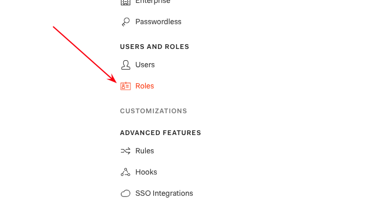
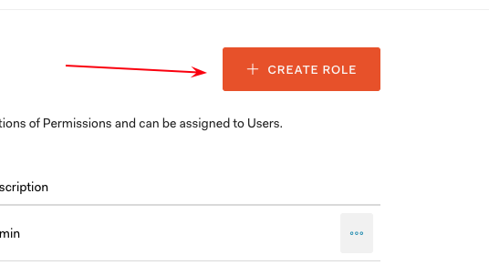
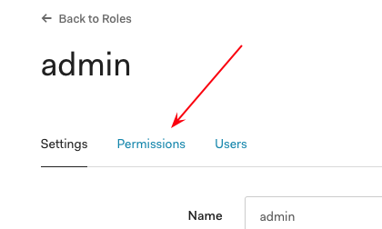
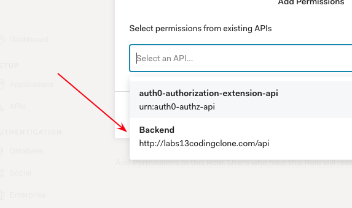
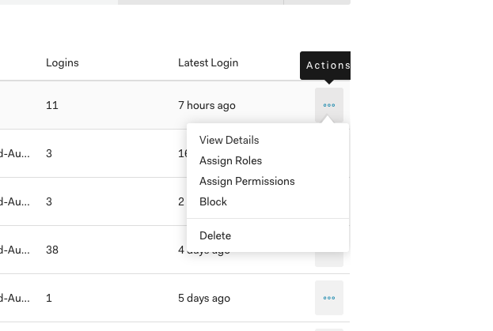
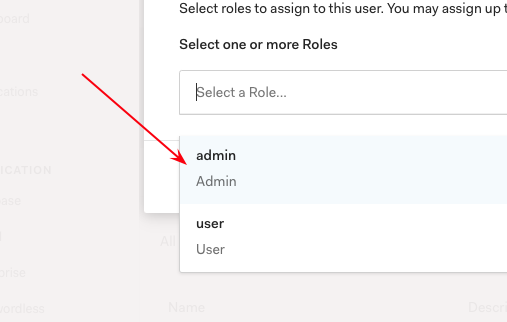

# Auth0 Roles Configuration and Management

## Client-Side Log In

Upon logging in with proper credentials from the Auth0 lock, the client will recieve an object. Retreive the access token and add it as an authorization header when making calls to the backend. After registration/login, the user is automaically assigned the user role if they do not have one. You need to log into Auth0 to change the role to admin manually. 

### Token Header
```
{
  "typ": "JWT",
  "alg": "RS256",
  "kid": "NUREQkNFODgxNDQ4QURGOUIyNzE2MzE3NDM3N0FDMEVENzU5ODIwQQ"
}
```

### Token Payload
```
{
  "iss": "https://labs13codingclone.auth0.com/",
  "sub": "auth0|5cf8398443ab360dc0d3a650",
  "aud": [
    "http://labs13codingclone.com/api",
    "https://labs13codingclone.auth0.com/userinfo"
  ],
  "iat": 1559836820,
  "exp": 1559844020,
  "azp": "cSsNtybGRAeZESuZVJXdaYild6OnMDLW",
  "scope": "openid profile",
  "permissions": [
    "user:user"
  ]
}
```

## Auth0 Authorization Extension Role Management

Currently, there is no checking for multiple roles in the Rules section. This will be added shortly. Managing roles, groups, and permissions in the Authorization Extension will eventually be deprecated by Auth0. [Authorization Extension Deprecation](https://auth0.com/docs/authorization/concepts/core-vs-extension)

Managing users` roles with Auth0 Core is being used to manage roles. Management of user roles can also be done with the Management API. 

The webhooks are in particular order acting similar to express middleware. The post registration webhook `auth0_postRegistration_webhook` adds the user role to anyone who registers to the application. 

The following are the steps to create roles and permissions and setting a user's role manually. 

#### Log into Auth0 to the Rules section


#### Create a new rule


#### Create permissions for the new role


#### Assign permissions to role that is related to permission in an applicaiton(backend)


#### View a user's details


#### Assign a role to user



### Auth0 Webhook Environment Variables
Two environment variables are shown in the `auth0_postRegistration_webhook.js` file. The `context.webtask.secrets.CLIENT_ID`  and `context.webtask.secrets.CLIENT_SECRET` are used to retreive a token that has permissions to add roles via Auth0's Management API. This is done so the token does not have to be manually set. This effectively automatically updates the token by requesting a token for every registration. 

