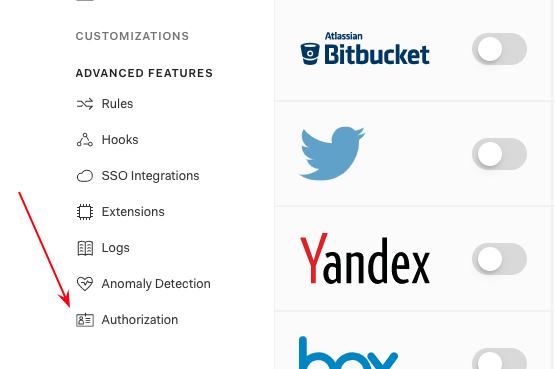
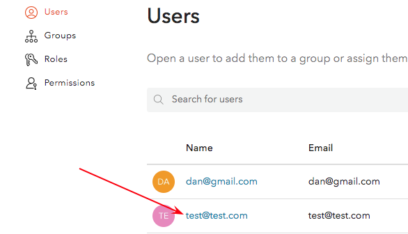
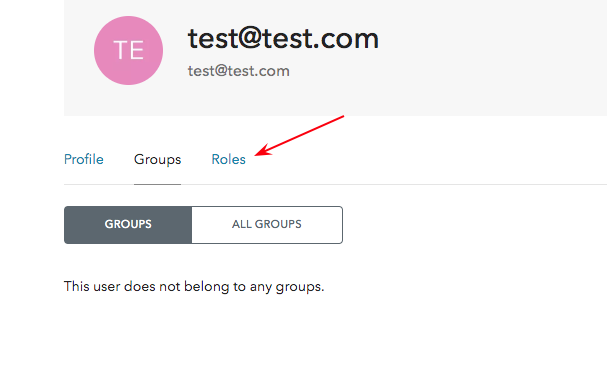
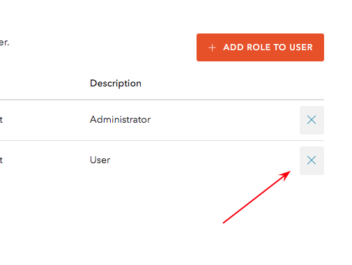
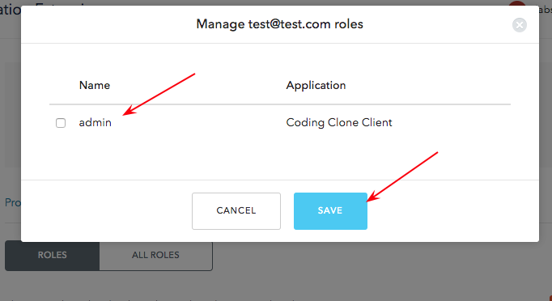

# Auth0 Roles Configuration and Management

## Client-Side Log In

Upon logging in with proper credentials from the Auth0 lock, the client will recieve an object. Retreive the idToken and add it as an authorization header when making calls to the backend. After registration/login, the user is automaically assigned the user role if they do not have one. You need to log into Auth0 to change the role to admin manually. 

The following user is a fake user. Certain keys and values have been modified for security purposes. 

### Token Header
```
{
  "typ": "JWT",
  "alg": "RS256",
  "kid": "NUREQkNFODgxNDQ4QURGOUIyNzE2MzE3NDM3N0FDAKJEkjs9w0"
}
```

### Token Payload
```
{
  "Customer_Claim": {
    "roles": [
      "user"
    ]
  },
  "nickname": "fake_user",
  "name": "fake_user@gmail.com",
  "picture": "Link_to_gravatar",
  "updated_at": "2019-06-03T01:46:34.455Z",
  "iss": "Link_to_Auth0_Acount",
  "sub": "auth0|5cf168e0065859890qr85938",
  "aud": "cSsNtybGRAeZESuZVJXdaYild6OnMDLW",
  "iat": 1559526396,
  "exp": 1559562396,
  "at_hash": "NL8XislktGM9rqb1StXDVw",
  "nonce": "CyaUJZ3zsYcTZEDXrYYnkf8dFoxK4oPw"
}
```

## Auth0 Authorization Extension Role Management

Currently, there is no checking for multiple roles in the Rules section. This will be added shortly. Managing roles, groups, and permissions in the Authorization Extension will eventually be deprecated by Auth0. [Authorization Extension Deprecation](https://auth0.com/docs/authorization/concepts/core-vs-extension)

Managing users` roles with Auth0 Core is a feature available with a paid account and is the recommended method. This implementation of role management with the Authorization Extension is possible with a free account. 

Management of user roles can also be done with the Management API. This will be tested to investigate its simplicity and ease of use. [Authorization Extension Documentation](https://auth0.com/docs/api/authorization-extension?http#get-all-users)

The Rules are in particular order acting similar to express middleware. The first rule `auth0_extension_rule.js` retrieves the current role, modifies the role if one is not present, re-retrieves the role and modifies the user object. The second role `set_role_in_idToken.js` adds the role to the idToken. The rules are executed after every login. 

#### Log into Auth0 to change the role to admin


#### Select the user you want to have the admin role 


#### Click the Roles tab 


#### Add a role


#### Select the admin role and save


#### Delete the user role


### Auth0 Rules Environment Variables
Three environment variables are shown in the auth0_extension_rule.js file. The `configuration.EXTENSION_URL` is actually placed as a string automatically when the Authorization extension is installed. This was removed from the file for security reasons. 

The `configuration.AUTH_KEY` was added to make a call to the Authorization Extension API to update the user role. A token was placed as an environment variable because I could not figure out another way to update the user. 

The `configuration.AUTHZ_EXT_API_KEY` was automatically added when Authorization extension is installed. This value is automatically renewed and is used to get the user roles, groups, and permissions. For reasons unkown, this could not be used to update the user's role. A `401` was received when this was attempted. 

Unfortunatly, the configuration.AUTH_KEY has to manually updated every ten days. One can renew the token by requesting a new token via the following cURL request. 

```
curl --request POST   --url https://AUTH0_TENANT_URL/oauth/token   --header 'content-type: application/json'   --data '{"client_id":"CLIENT_ID","client_secret":"CLIENT_SECRET","audience":"urn:auth0-authz-api","grant_type":"client_credentials"}'
```

The client_id, url, and client_secret have been modified for security purposes. 

